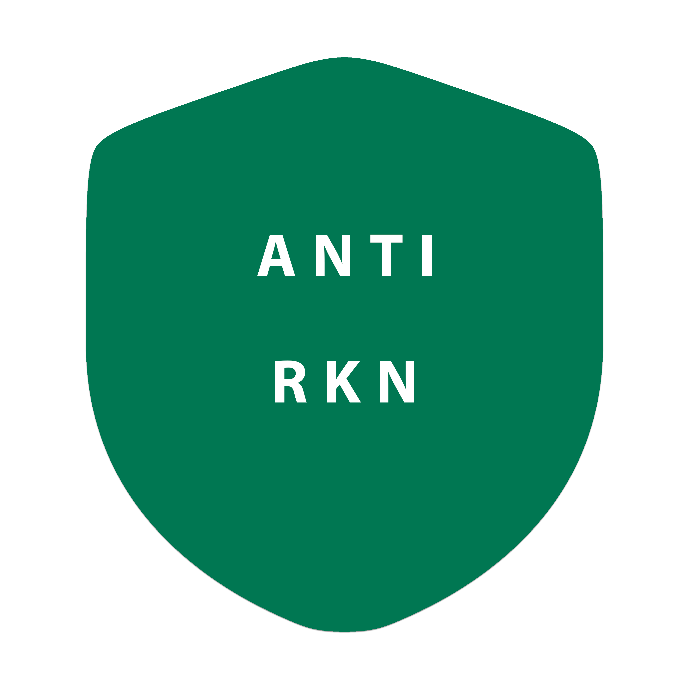

<div dir="ltr" align=center>
    
[** فارسی**](README_fa.md) / [**Русский 🇷🇺**](README_ru.md) / [**简体中文 🇨🇳**](README_cn.md) / [**日本語 🇯🇵**](README_ja.md) / [**Portugês-BR 🇧🇷**](README_br.md)

*(translated READMEs above are from upstream and predate this fork's changes below)*

</div>
<br>

<p align="center"></p>
<br>

## What is this?

Pup is a personal, cross-platform proxy/VPN client - a fork of [Hiddify](https://github.com/hiddify/hiddify-app), which is itself built on the [sing-box](https://github.com/SagerNet/sing-box) universal proxy tool-chain. It targets Android, iOS, Windows, macOS and Linux from one codebase.

This is **not** the official Hiddify app, is **not** on any app store, and is **not** affiliated with the Hiddify project beyond being derived from it. It's maintained for a small personal/friends circle and distributed by sideload / TestFlight, not through Google Play or the App Store - see [Publishing](#-publishing) below for why.

On top of upstream Hiddify, this fork adds:
- default routing that keeps RU domains/IPs off the tunnel (direct), plus a curated per-app split-tunneling list for RU banking/marketplace/social apps that VPN-detect
- [olcRTC](https://github.com/openlibrecommunity/olcrtc) support - a WebRTC tunnel disguised as an ordinary video call (Jitsi/Telemost/WbStream), as a native outbound
- a randomized (not `tun0`/`netlink0`-style) TUN interface name, persisted across reconnects
- a self-check screen that flags things like exposed local ports, default-looking interface names, and TLS-based outbounds missing uTLS/REALITY
- rebranding (name, icons) away from Hiddify's own

<div align=center>


</div>

## 🧱 Architecture

```
Flutter UI (lib/)  <-- gRPC -->  hiddify-core (Go)
                                       |
                                       |  registers protocols into
                                       v
                              hiddify-sing-box (vendored sing-box fork)
                                       ^
                                       |  outbound configs built from
                                       |  pasted links / subscriptions
                                 ray2sing (Go)
```

- **`lib/`** - the Flutter app: profile management, routing/settings UI, self-check screen, per-app split-tunneling picker. Talks to the native core over gRPC, not FFI, so it's the same client code across all five platforms.
- **`hiddify-core/`** - a Go program that owns the actual proxy engine and exposes it to the Flutter side. On desktop it runs as a sidecar process (`HiddifyCli.exe` on Windows, equivalent on macOS/Linux); on mobile it's embedded as a native library via gomobile (Android `.aar`, iOS `.xcframework`).
- **`hiddify-core/hiddify-sing-box/`** - a vendored, patched fork of upstream sing-box (`replace`-directed in `go.mod`, not a submodule). New outbound protocols get added here following an established pattern: a constant in `constant/proxy.go`, an options struct in `option/`, an adapter in `protocol/hiddify/<name>/`, one registration line in `include/registry.go`. `mieru`, `dnstt`, `psiphon` and now `olcrtc` all follow this shape.
- **`hiddify-core/ray2sing/`** - a small, separate Go module that turns a pasted link or subscription line (`vless://`, `trojan://`, `olcrtc://`, ...) into a sing-box outbound config. It's what `v2/config/parser.go` calls when you import a profile.
- **Native platform layer** - Network Extension (iOS/macOS), `VpnService` (Android), WinTun (Windows), tun2socks-equivalent (Linux). This is real per-OS code and the one place platform quirks (like Android's own TUN naming, or JNI boundary crashes) get handled directly rather than papered over.

Routing decisions (which domains/apps go direct vs. through the tunnel) are computed in `hiddify-core/v2/config` and shipped to sing-box as `route.rules`.

## 🚀 Main features

✈️ Multi-platform: Android, iOS, Windows, macOS and Linux

⭐ Intuitive and accessible UI

🔍 Delay based node selection

🟡 Wide range of protocols:
Vless, Vmess, Reality, TUIC, Hysteria, Wireguard, SSH etc.

🟡 Subscription link and configuration formats: Sing-box, V2ray, Clash, Clash meta

🔄 Automatic subscription update

🔎 Display profile information including remaining days and traffic usage

🛡 Open source, secure and community driven

🌙 Dark and light modes

⚙ Compatible with all proxy management panels

⭐ Appropriate configuration for Iran, China, Russia and other countries

## 📥 Downloads

Not on any app store - see this repo's [Releases page](https://github.com/beliberda/pup-app/releases) for sideload builds (Android APK, Windows exe/zip) and TestFlight for iOS/macOS.

## ⚙️ Installation and tutorials

The UI is largely inherited from upstream Hiddify, so its [wiki/tutorials](https://hiddify.com/app/) are still a reasonable general reference for day-to-day usage - just not for anything fork-specific described above.

## 🌎 Translations

Locale strings live in `/assets/translations` as plain JSON - edit them directly.

## ✏️ Acknowledgements

We would like to express our sincere appreciation to the contributors of the following projects, whose robust foundation and innovative features have significantly enhanced the success and functionality of this project.

- [Sing-box](https://github.com/SagerNet/sing-box)
- [Sing-box for Android](https://github.com/SagerNet/sing-box-for-android)
- [Sing-box for Apple](https://github.com/SagerNet/sing-box-for-apple)
- [Clash](https://github.com/Dreamacro/clash)
- [Clash Meta](https://github.com/MetaCubeX/Clash.Meta)
- [FClash](https://github.com/Fclash/Fclash)
- [Vazirmatn Font by Saber Rastikerdar](https://github.com/rastikerdar/vazirmatn)
- [Others](./pubspec.yaml)

## 🍎🤖 Publishing

This fork is **not published** to Google Play or the App Store, on purpose: the routing/circumvention features above (RU-domain bypass, olcRTC's disguised tunnel) are exactly the kind of positioning both stores reject client apps for, and a rejected/banned developer account is a real, hard-to-reverse cost for what is a personal-use tool. Distribution is sideload (Android/Windows/Linux) and TestFlight (iOS/macOS) for a small personal circle instead.

## 👩‍🏫 Upstream project

This is a personal fork, not a community project taking outside contributions - if you're looking for the actively maintained, official app, see [hiddify/hiddify-app](https://github.com/hiddify/hiddify-app) and [hiddify.com](https://hiddify.com).


